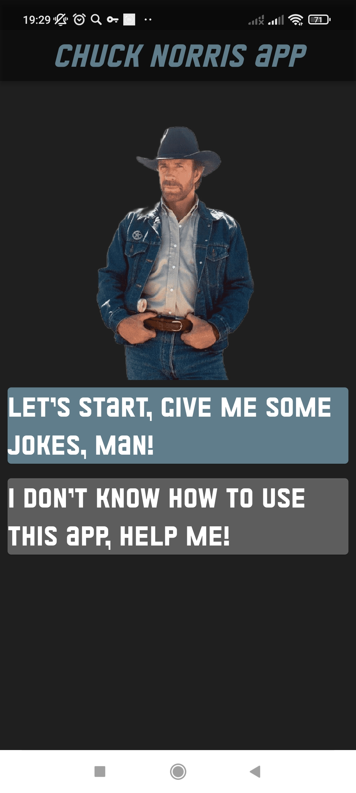
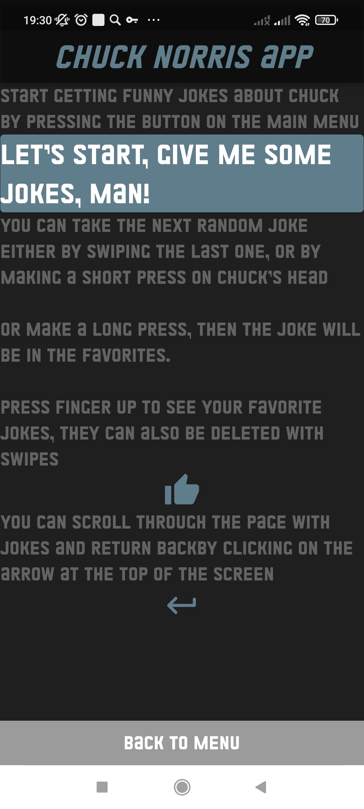
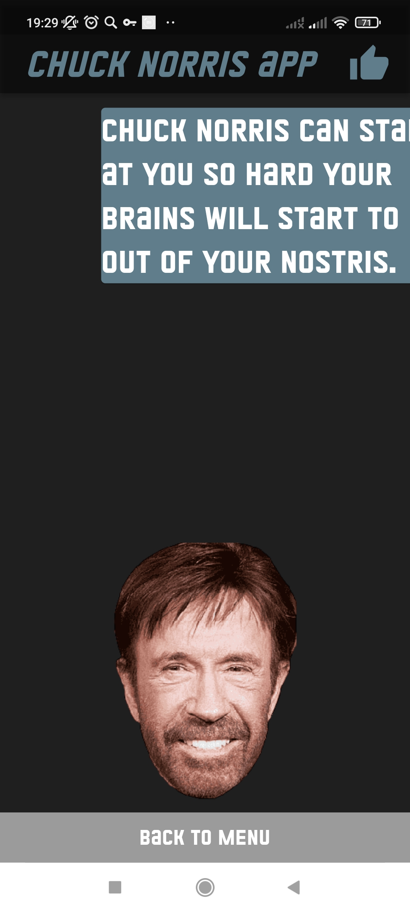
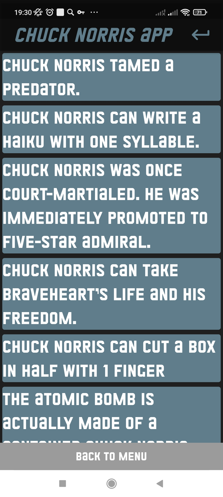

# Chuck Norris Application
Flutter project for [Sum 22] CPMDWithF course by Pechersky Ilya, BS21-04, Innopolis University

## Available

You can download __.apk__ [here](https://drive.google.com/drive/folders/1BzTfZ4mI7ffnUS45wWGYnSN6pPvnSvjy?usp=sharing)

## Breath description
This project is a tinder-like application with opportunity to have fun with jokes about famous actor Chuck Norris.
On menu page you will see two buttons: \

If you want to know how to use this app tab "help me" button: \

Functionality is very simple: you can see only one joke at once and you have to actions to change a joke:
- to swipe.
- to tab beautiful Chuck's face.
- to make long tab (joke will be added to the favorites) \

[//]: # (Hello) \

Tab like button to see your favorites: \

If your connection is lost app will hangle it and show you: \

